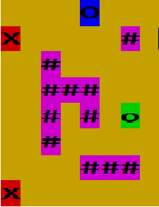

Программа должна генерировать случайную карту с препятствиями. Игрок и его враги располагаются на карте случайным образом. Каждый элемент карты должен иметь определенный цвет.

**Пример сгенерированной карты**:

**Обозначения**:  
`o` - позиция игрока (пользователя программы) на карте. 
`#` - препятствие 
`x` - противник (искусственный интеллект) 
`O` - целевая точка, до которой игрок должен добраться прежде, чем враги доберутся до игрока. Игрок считается достигшим целевой клетки, если он наступил на ее позицию.

**Правила игры**:
1. Каждый участник (игрок и враги) может сделать один ход. Затем наступает очередь другого участника. Враг считается достигшим игрока, если он может наступить на позицию игрока, сделав текущий ход.
2. Доступные направления движения: влево, вправо, вниз и вверх.
3. Если противник не может двигаться вперед (вокруг него есть препятствия или другие враги, или достигнут край карты), противник пропускает ход.
4. Целевая точка является препятствием для противника.
5. Если игрок не может двигаться вперед (окружен препятствиями, врагами или достиг края карты), он проигрывает игру.
6. Игрок проигрывает, если враг обнаружит его до того, как он достигнет целевой точки.
7. Игрок начинает игру первым.
8. Если в начале или середине игры игрок понимает, что целевая точка недостижима, он должен закончить игру, набрав 9 (игрок проигрывает).

**Запуск игры**:  
`$ java -jar game-jar-with-dependencies.jar--enemiesCount=10 --wallsCount=10 --size=30 --profile=production`  
1. `--enemiesCount=` - количество врагов  
2. `--wallsCount=` - количество препятствий  
3. `--size=` - размер поля  
4. `--profile=` - режим игры  

**Режимы игры**:  
Конфигурационный файл для запуска приложения находятся в папке resources.  
1. production  
Конфигурационный файл: `application-production.properties`
2. develop  
Конфигурационный файл: `application-production.develop`

Пример этого файла показан ниже:  
enemy.char = X  
player.char = o  
wall.char = #  
goal.char = O  
empty.char=  
enemy.color = RED  
player.color = GREEN  
wall.color = MAGENTA  
goal.color = BLUE  
empty.color = YELLOW  